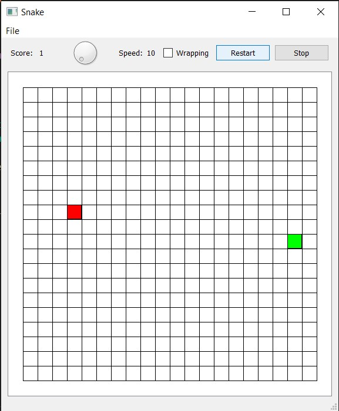

# SnakePy

Implementation of classic Snake game in Python

Functions avaliable:
1. Setting Speed of Snake
2. Wrapping of Snake 
3. Showing current Score
4. Restart of the game
5. Stop / Resume

Snake GUI: 

